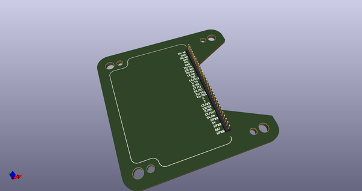
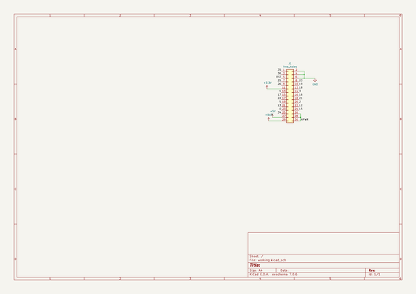
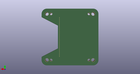
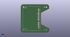

# OOMP Project  
## CavityDentureForM5Stack  by asukiaaa  
  
oomp key: oomp_projects_flat_asukiaaa_cavitydentureform5stack  
(snippet of original readme)  
  
- CavityDentureForM5Stack  
  
A kicad project for denture for [CavityForM5Stack](https://github.com/asukiaaa/CavityForM5Stack).  
  
  
  
- Usage  
  
Use this project as a template of KiCad to create your original denture.  
  
If you order PCB, 1mm thickness denture will good for CavityForM5Stack.  
  
- License  
  
MIT  
  
- References  
  
- [M5StackのStackに背の高い部品を利用できるM5StackCavityを作ってみた](http://asukiaaa.blogspot.com/2019/08/m5stackstackm5stackcavity.html)  
- [KiCadでテンプレートを作って使う方法](http://asukiaaa.blogspot.com/2019/12/kicad-template.html)  
  
  full source readme at [readme_src.md](readme_src.md)  
  
source repo at: [https://github.com/asukiaaa/CavityDentureForM5Stack](https://github.com/asukiaaa/CavityDentureForM5Stack)  
## Board  
  
  
## Schematic  
  
  
  
[schematic pdf](working_schematic.pdf)  
## Images  
  
  
  
  
  
  
