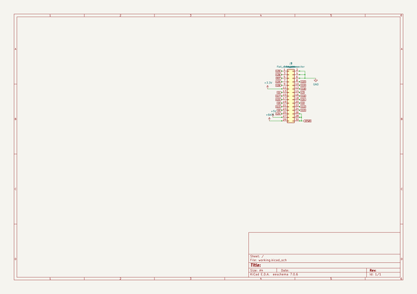

# OOMP Project  
## CavityForM5Stack  by asukiaaa  
  
oomp key: oomp_projects_flat_asukiaaa_cavityform5stack  
(snippet of original readme)  
  
- CavityForM5Stack  
  
PCBs to create a cavity for M5Stack.  
  
  
  
  
- License  
  
MIT  
  
- References  
  
- [CavityForM5Stack ピンソケット、ブレッドボード無し](https://www.switch-science.com/catalog/5684/)  
- [CavityForM5Stack ピンソケット、ブレッドボード付き](https://www.switch-science.com/catalog/5685/)  
- [M5StackのStackに背の高い部品を利用できるM5StackCavityを作ってみた](http://asukiaaa.blogspot.com/2019/08/m5stackstackm5stackcavity.html)  
  
  full source readme at [readme_src.md](readme_src.md)  
  
source repo at: [https://github.com/asukiaaa/CavityForM5Stack](https://github.com/asukiaaa/CavityForM5Stack)  
## Board  
  
  
## Schematic  
  
  
  
[schematic pdf](working_schematic.pdf)  
## Images  
  
  
  
  
  
  
