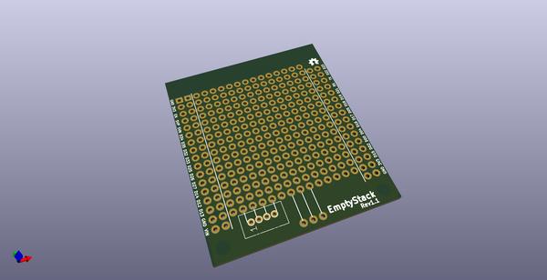
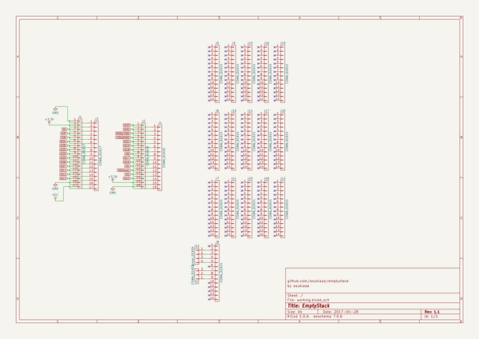
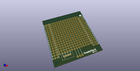
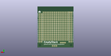
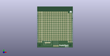

# OOMP Project  
## emptystack  by asukiaaa  
  
oomp key: oomp_projects_flat_asukiaaa_emptystack  
(snippet of original readme)  
  
- EmptyStack  
A kicad project of empty stacking board.  
  
  
  
  
In combination with [ESP32Stack](https://github.com/asukiaaa/esp32stack).  
  
  
- License  
MIT  
  
- Components  
- [Long leg pinsocket](https://www.aliexpress.com/item/8-5-0-0-10-5mm-0-1-pitch-0-4U-gold-plated-1x20-Stacking-Header/32676523255.html?spm=2114.13010608.0.0.rdhnP8)  
  
Optional  
  
- [Grove 90 degree connector](https://www.seeedstudio.com/Grove-Universal-4-pin-connector-90%C2%B0%2810-PCs%29-p-790.html)  
  
- References  
- [ESP32Stack](https://github.com/asukiaaa/esp32stack)  
  full source readme at [readme_src.md](readme_src.md)  
  
source repo at: [https://github.com/asukiaaa/emptystack](https://github.com/asukiaaa/emptystack)  
## Board  
  
  
## Schematic  
  
  
  
[schematic pdf](working_schematic.pdf)  
## Images  
  
  
  
  
  
  
