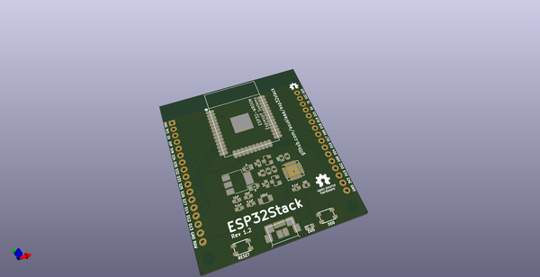
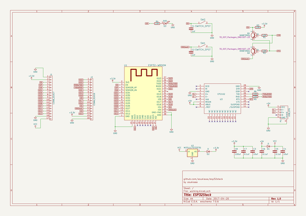
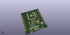
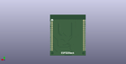
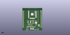

# OOMP Project  
## esp32stack  by asukiaaa  
  
oomp key: oomp_projects_flat_asukiaaa_esp32stack  
(snippet of original readme)  
  
- ESP32Stack  
A kicad project of stacking board with using ESP-WROOM-32.  
  
  
  
  
  
In combination with [EmptyStack](https://github.com/asukiaaa/emptystack).  
  
  
[schema](docs/esp32stack.pdf)  
  
- Driver  
This board uses CP2102 for serial communication.  
For mac and windiws user, please install the following driver.  
Linux supports cp2102 defaul, so linux user does not need any driver.  
  
[CP210x USB to UART Bridge VCP Drivers](http://www.silabs.com/products/development-tools/software/usb-to-uart-bridge-vcp-drivers)  
  
- Shop  
[trial stacks](https://trialstacks.base.ec/items/6243777)  
  
- Components  
- [esp-wroop-32](http://akizukidenshi.com/catalog/g/gM-11647/)  
- [Hirose-microB-USB](http://akizukidenshi.com/catalog/g/gC-05254/)  
- [Diode](http://akizukidenshi.com/catalog/g/gI-05951/)  
- [transistor MMBT3904](http://akizukidenshi.com/catalog/g/gI-05969/)  
- [switch SKRPACE010](http://akizukidenshi.com/catalog/g/gP-06185/)  
- [100uf 1206 condensor](http://akizukidenshi.com/catalog/g/gP-08260/)  
- [10uf 0603 condensor](http://akizukidenshi.com/catalog/g/gP-07768/)  
- [0.1uf 0603 condensor](http://akizukidenshi.com/catalog/g/gP-04940/)  
- [1nf (1000pf) 0603 condensor](http://akizukidenshi.com/catalog/g/gP-09285/)  
- [10k 0603 registor](http://akizukidenshi.com/catalog/g/gR-06103/)  
- [led](http://akizukidenshi.com/catalog/g/gI-06417/)  
- [CP2102](https://www.aliexp  
  full source readme at [readme_src.md](readme_src.md)  
  
source repo at: [https://github.com/asukiaaa/esp32stack](https://github.com/asukiaaa/esp32stack)  
## Board  
  
  
## Schematic  
  
  
  
[schematic pdf](working_schematic.pdf)  
## Images  
  
  
  
  
  
  
