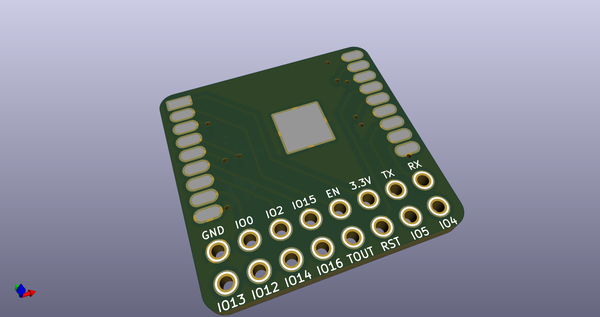
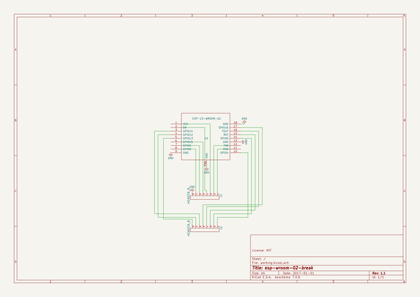
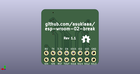
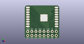

# OOMP Project  
## esp-wroom-02-break  by asukiaaa  
  
oomp key: oomp_projects_flat_asukiaaa_esp_wroom_02_break  
(snippet of original readme)  
  
- esp-wroom-02-break  
A kicad project for esp-wroom-02  
  
  
  
- License  
MIT  
  full source readme at [readme_src.md](readme_src.md)  
  
source repo at: [https://github.com/asukiaaa/esp-wroom-02-break](https://github.com/asukiaaa/esp-wroom-02-break)  
## Board  
  
  
## Schematic  
  
  
  
[schematic pdf](working_schematic.pdf)  
## Images  
  
  
  
  
  
  
