# OOMP Project  
## grove-connector-breakout-board  by asukiaaa  
  
oomp key: oomp_projects_flat_asukiaaa_grove_connector_breakout_board  
(snippet of original readme)  
  
- grove-connector-breakout-board  
  
Breakout boards to use grove connector on a bread board.  
  
  
  
-- Setup  
  
This project use submodule so execute this command after cloning.  
  
```  
git submodule update --init --recursive  
```  
  
-- horizontal-both-sides  
  
  
  
-- horizontal-one-line  
  
  
  
-- vertical-both-sides  
  
  
  
-- vertical-one-line  
  
  
  
-- References  
  
- [Groveコネクタをブレッドボードで使うためのブレイクアウトボードを作ってみた](https://asukiaaa.blogspot.com/2020/12/grove-connector-breakout.html)  
- [Grove System](https://wiki.seeedstudio.com/Grove_System/)  
  
  full source readme at [readme_src.md](readme_src.md)  
  
source repo at: [https://github.com/asukiaaa/grove-connector-breakout-board](https://github.com/asukiaaa/grove-connector-breakout-board)  
## Board  
  
[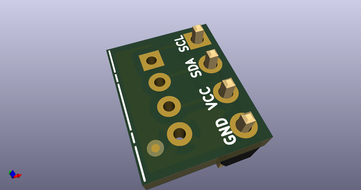](working_3d.png)  
## Schematic  
  
[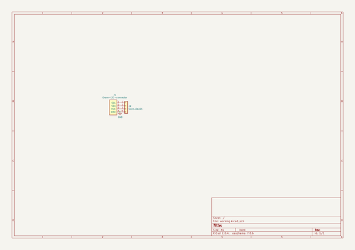](working_schematic.png)  
  
[schematic pdf](working_schematic.pdf)  
## Images  
  
[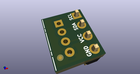](working_3d.png)  
  
[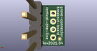](working_3d_back.png)  
  
[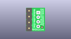](working_3D_bottom.png)  
  
[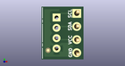](working_3d_front.png)  
  
[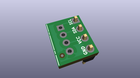](working_3D_top.png)  
  
[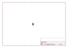](working_assembly_page_01.png)  
  
[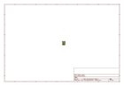](working_assembly_page_02.png)  
  
[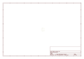](working_assembly_page_03.png)  
  
[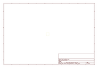](working_assembly_page_04.png)  
  
[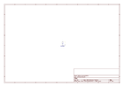](working_assembly_page_05.png)  
  
[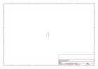](working_assembly_page_06.png)  
