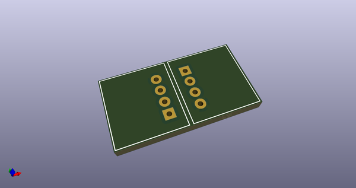
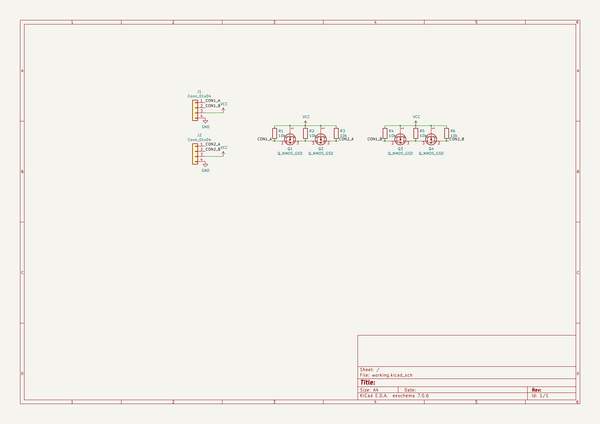
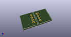
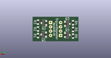
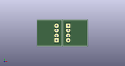

# OOMP Project  
## GroveSignalRepeater  by asukiaaa  
  
(snippet of original readme)  
  
- GroveSignalRepeater  
  
Repeat signal with using mosfet.  
  
- License  
  
MIT  
  
- References  
  
- [Grove System - Seeed wiki](https://wiki.seeedstudio.com/Grove_System/)  
- [SparkFun Logic Level Converter - Bi-Directional](https://www.sparkfun.com/products/12009)  
- [Logic_Level_Bidirectional.pdf](http://cdn.sparkfun.com/datasheets/BreakoutBoards/Logic_Level_Bidirectional.pdf)  
  
  full source readme at [readme_src.md](readme_src.md)  
  
source repo at: [https://github.com/asukiaaa/GroveSignalRepeater](https://github.com/asukiaaa/GroveSignalRepeater)  
## Board  
  
  
## Schematic  
  
  
  
[schematic pdf](working_schematic.pdf)  
## Images  
  
  
  
  
  
  
