# OOMP Project  
## I2cControlPanel  by asukiaaa  
  
(snippet of original readme)  
  
- I2cControlPanel  
  
A wired control panel.  
  
  
  
  
- Where to buy  
  
- [I2cControlPanel | スイッチサイエンス](https://www.switch-science.com/catalog/6824/)  
  
- Library  
[I2cControlPanel_asukiaaa](https://github.com/asukiaaa/I2cControlPanel_asukiaaa)  
  
- Components  
  
- [ATmega328PB-MU](https://www.digikey.jp/product-detail/ja/microchip-technology/ATMEGA328PB-MUR/ATMEGA328PB-MURCT-ND/5722708)  
- [PS4 joy stick](https://ja.aliexpress.com/item/1005001729380060.html)  
- [PS4 joy stick cap](https://ja.aliexpress.com/item/32964247181.html)  
- [THT encoder](https://ja.aliexpress.com/item/1005001556801559.html)  
- [Switch 12mm black](https://akizukidenshi.com/catalog/g/gP-09826/)  
- [LCD 8x2](https://akizukidenshi.com/catalog/g/gP-06669/)  
- [Slide switch](https://akizukidenshi.com/catalog/g/gP-12723/)  
- [3V3 regulator](https://akizukidenshi.com/catalog/g/gI-10675/)  
- [LED 0603 green](https://akizukidenshi.com/catalog/g/gI-06417/)  
- [0.47uf 0402](https://akizukidenshi.com/catalog/g/gP-07504/)  
- [0.01uf 0603](https://akizukidenshi.com/catalog/g/gP-13387/)  
- 0.1uf 0603  
- [Diode array](https://www.digikey.jp/product-detail/ja/toshiba-semiconductor-and-storage/1SS309-TE85L-F/1SS309-TE85LF-CT-ND/4304019)  
- 10k 0603  
  
- Old components  
  
- [Panel mount encoder](https://ja.aliexpress.com/item/32783863247.html)  
- [Low height joystick](https://ja.aliexpress.com/item/4000540937190.html)  
- [Low height joystick cap](https://ja.aliex  
  full source readme at [readme_src.md](readme_src.md)  
  
source repo at: [https://github.com/asukiaaa/I2cControlPanel](https://github.com/asukiaaa/I2cControlPanel)  
## Board  
  
  
## Schematic  
  
[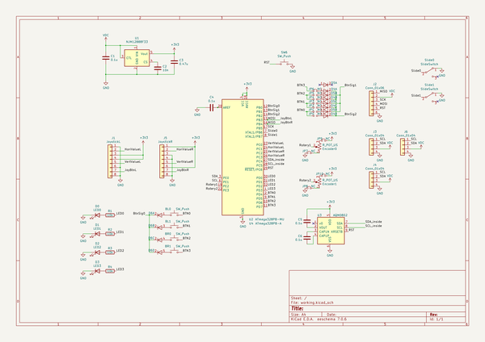](working_schematic.png)  
  
[schematic pdf](working_schematic.pdf)  
## Images  
  
[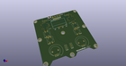](working_3d.png)  
  
[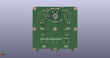](working_3d_back.png)  
  
[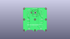](working_3D_bottom.png)  
  
[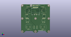](working_3d_front.png)  
  
[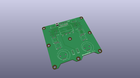](working_3D_top.png)  
  
[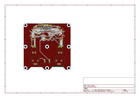](working_assembly_page_01.png)  
  
[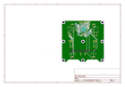](working_assembly_page_02.png)  
  
[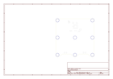](working_assembly_page_03.png)  
  
[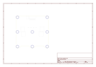](working_assembly_page_04.png)  
  
[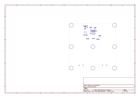](working_assembly_page_05.png)  
  
[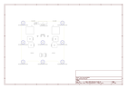](working_assembly_page_06.png)  
