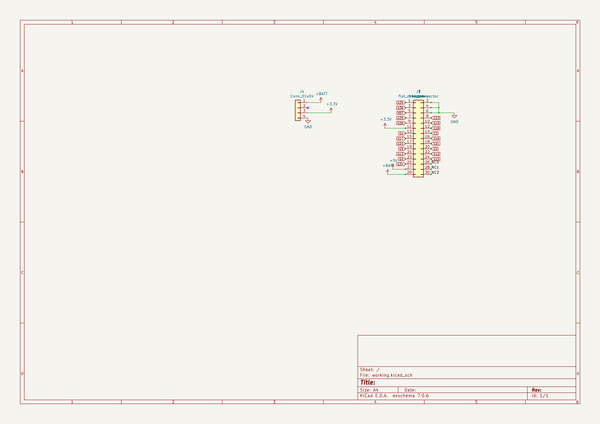
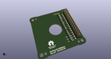
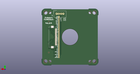
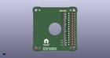

# OOMP Project  
## I2cMotorsForM5Stack  by asukiaaa  
  
(snippet of original readme)  
  
- I2cMotorsForM5Stack  
  
A motor driver with using atmega328p for M5Stack.  
  
- TODO  
  
- Replace D3 to small current and high voltage one  
  
- Components  
  
- [TB6612FNG](http://akizukidenshi.com/catalog/g/gI-11317/)  
- [Diode](https://akizukidenshi.com/catalog/g/gI-02073/)  
- [Terminal block](https://akizukidenshi.com/catalog/g/gP-08370/)  
- Gear motor 6v200rpm  
  
- License  
  
MIT  
  
- References  
  
- [SparkFun Motor Driver - Dual TB6612FNG (1A)](https://www.sparkfun.com/products/14451)  
- [CavityForM5Stack](https://github.com/asukiaaa/CavityForM5Stack)  
- [Arduino Pro Mini schematic (PDF)](https://www.arduino.cc/en/uploads/Main/Arduino-Pro-Mini-schematic.pdf)  
  
  full source readme at [readme_src.md](readme_src.md)  
  
source repo at: [https://github.com/asukiaaa/I2cMotorsForM5Stack](https://github.com/asukiaaa/I2cMotorsForM5Stack)  
## Board  
  
  
## Schematic  
  
  
  
[schematic pdf](working_schematic.pdf)  
## Images  
  
  
  
  
  
  
