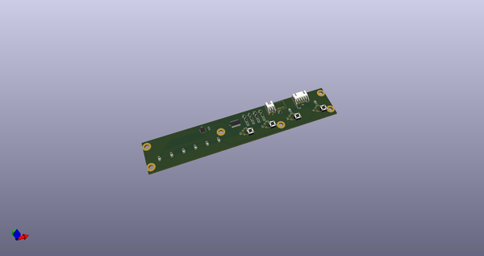
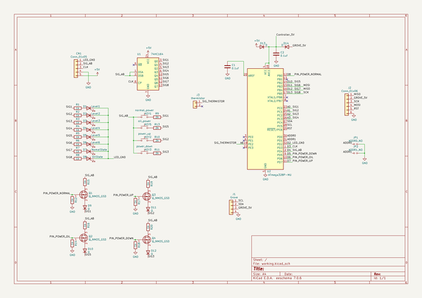
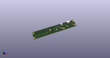
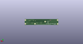
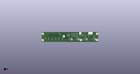

# OOMP Project  
## IRIS-OHYAMA-IHK-T35-I2C-Controller-PCB  by asukiaaa  
  
(snippet of original readme)  
  
- IRIS-OHYAMA-IHK-T35-I2C-Controller-PCB  
  
A pcb to make IH cooking heater as a I2C device.  
  
- Components  
  
- [n-ch MOSFET SOT-23 GSD](http://akizukidenshi.com/catalog/g/gI-04232/)  
- [Diode SOD-123F](http://akizukidenshi.com/catalog/g/gI-06014/)  
- atmega328p or atmega328pb  
- 0.1uf condensors  
- leds  
- 1k and 2k resistors  
- XH Connector 1x5 and 1x2  
  
- License  
  
MIT  
  
- Reference  
  
- [Arduino Nano Rev3.2](https://www.arduino.cc/en/uploads/Main/Arduino_Nano-Rev3.2-SCH.pdf)  
- [電磁調理器の信号線を引き出してArduinoで制御してみた](https://asukiaaa.blogspot.com/2020/03/irisohyama-IHK-T35-arduino.html)  
- [1口IHコンロ（1400W） ](https://www.irisohyama.co.jp/products/electrical-appliances/cooking-appliances/ih-cooking-heater/1-ih-cooking-heater/1-ih-cooking-heater-tabletop-1400)  
- [IHコンロIHK-T35 取扱説明書(PDF)](https://www.irisohyama.co.jp/products/manual/pdf/572260.pdf)  
  
  full source readme at [readme_src.md](readme_src.md)  
  
source repo at: [https://github.com/asukiaaa/IRIS-OHYAMA-IHK-T35-I2C-Controller-PCB](https://github.com/asukiaaa/IRIS-OHYAMA-IHK-T35-I2C-Controller-PCB)  
## Board  
  
  
## Schematic  
  
  
  
[schematic pdf](working_schematic.pdf)  
## Images  
  
  
  
  
  
  
