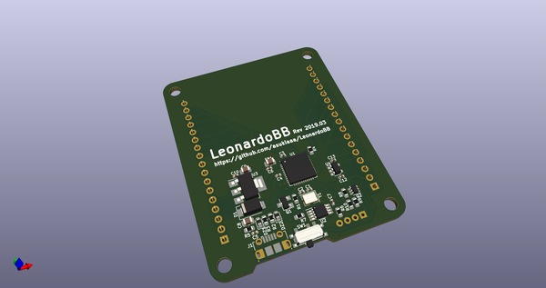
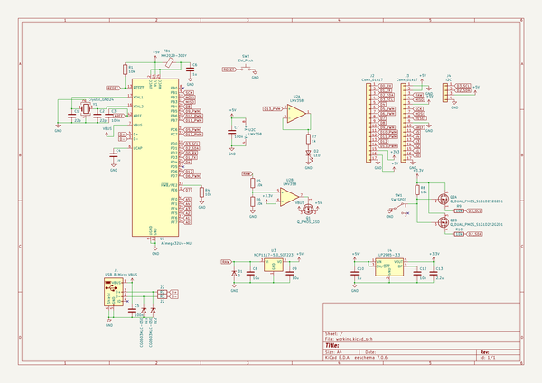
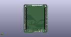
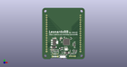

# OOMP Project  
## LeonardoBB  by asukiaaa  
  
oomp key: oomp_projects_flat_asukiaaa_leonardobb  
(snippet of original readme)  
  
- LeonardoBB  
  
PCB to use an Arduino Leonardo and a bread board together.  
  
- License  
MIT  
  
- References  
- [PDF: Arduino LEONARDO Schematic](https://www.arduino.cc/en/uploads/Main/arduino-leonardo-schematic_3b.pdf)  
- [PDF: Arduino Pro Micro](https://cdn.sparkfun.com/datasheets/Dev/Arduino/Boards/Pro_Micro_v13b.pdf)  
  
  full source readme at [readme_src.md](readme_src.md)  
  
source repo at: [https://github.com/asukiaaa/LeonardoBB](https://github.com/asukiaaa/LeonardoBB)  
## Board  
  
  
## Schematic  
  
  
  
[schematic pdf](working_schematic.pdf)  
## Images  
  
  
  
  
  
  
