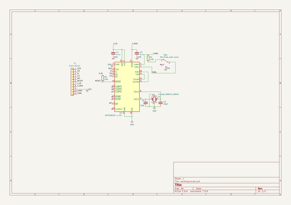
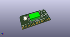
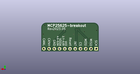
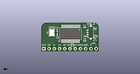
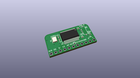
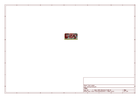
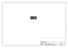
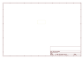
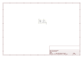

# OOMP Project  
## MCP25625-breakout  by asukiaaa  
  
oomp key: oomp_projects_flat_asukiaaa_mcp25625_breakout  
(snippet of original readme)  
  
- MCP25625-breakout  
  
A breakout board of MCP25625.  
  
  
  
Schematic: [docs/mcp25625-breakout.pdf](docs/mcp25625-breakout.pdf)  
  
-- Components  
  
- MCP25625 SSOP28  
- 0.1uf 0402  
- 22pf 0402  
- 120 ohm 0402  
- [slide switch smd](https://akizukidenshi.com/catalog/g/gP-13989/)  
- [16MHz crystal](https://akizukidenshi.com/catalog/g/gP-02457/)  
  
-- Where to buy  
  
[MCP25625-breakout](https://www.switch-science.com/catalog/7228/)  
  
-- License  
  
MIT  
  
-- References  
  
- [CanBusMCP2515-arduino](https://github.com/asukiaaa/CanBusMCP2515-arduino)  
- [CANをArduinoで使ってみた](https://asukiaaa.blogspot.com/2021/07/canarduino.html)  
- [製品紹介 MCP25625-breakout](https://asukiaaa.blogspot.com/2021/06/mcp25625-breakout.html)  
  
  full source readme at [readme_src.md](readme_src.md)  
  
source repo at: [https://github.com/asukiaaa/MCP25625-breakout](https://github.com/asukiaaa/MCP25625-breakout)  
## Board  
  
  
## Schematic  
  
  
  
[schematic pdf](working_schematic.pdf)  
## Images  
  
  
  
  
  
  
  
  
  
  
  
  
  
  
  
  
  
  
  
  
  
  
