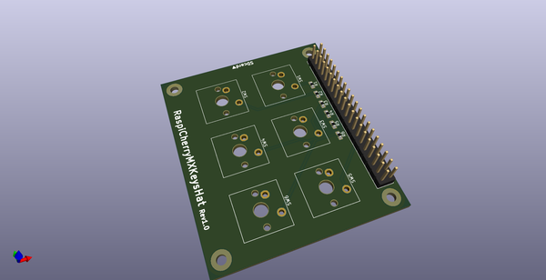
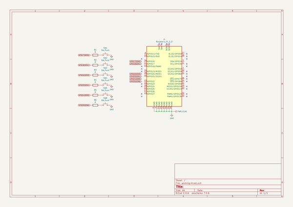
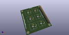
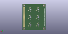
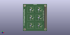

# OOMP Project  
## RaspiCherryMXKeysHat  by asukiaaa  
  
(snippet of original readme)  
  
- RaspiCherryMXKeysHat  
A Raspberry Pi Hat for Cherry MX Keys.  
  
  
  
- Connections  
  
Switch | Pin  
--- | ---  
SW1 | GPIO17  
SW2 | GPIO18  
SW3 | GPIO22  
SW4 | GPIO23  
SW5 | GPIO24  
SW6 | GPIO25  
  
- License  
MIT  
  
  full source readme at [readme_src.md](readme_src.md)  
  
source repo at: [https://github.com/asukiaaa/RaspiCherryMXKeysHat](https://github.com/asukiaaa/RaspiCherryMXKeysHat)  
## Board  
  
  
## Schematic  
  
  
  
[schematic pdf](working_schematic.pdf)  
## Images  
  
  
  
  
  
  
