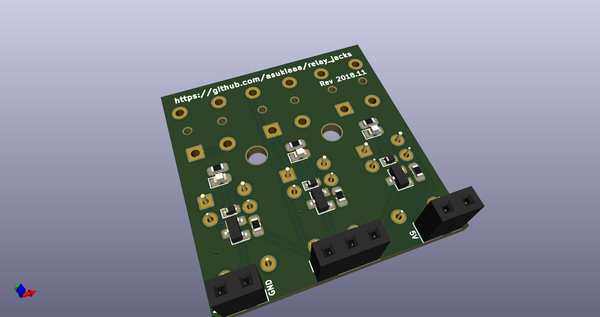
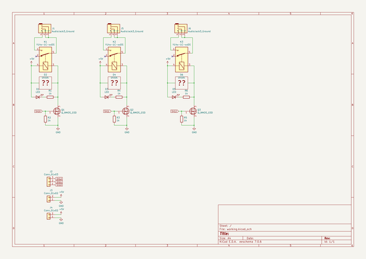
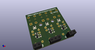
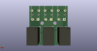
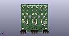

# OOMP Project  
## relay_jacks  by asukiaaa  
  
(snippet of original readme)  
  
- relay_jacks  
  
A KiCad pcb project for jacks controlled by relay.  
  
  
  
  
  
[mpu9250-25mm-belt-holder](https://github.com/asukiaaa/mpu9250-25mm-belt-holder) is used for a sensor case.  
  
- Components  
  
- [Relay](http://akizukidenshi.com/catalog/g/gP-01346/)  
- [Mosfet](http://akizukidenshi.com/catalog/g/gI-04256/)  
- [Diode](http://akizukidenshi.com/catalog/g/gI-06467/)  
- [Resistor 1k](http://akizukidenshi.com/catalog/g/gR-06102/)  
- [3.5mm audio jack](http://akizukidenshi.com/catalog/g/gC-02460/)  
- [LED Green](http://akizukidenshi.com/catalog/g/gI-06417/)  
- [LED Yellow](http://akizukidenshi.com/catalog/g/gI-03984/)  
- [LED Red](http://akizukidenshi.com/catalog/g/gI-03978/)  
  
  full source readme at [readme_src.md](readme_src.md)  
  
source repo at: [https://github.com/asukiaaa/relay_jacks](https://github.com/asukiaaa/relay_jacks)  
## Board  
  
  
## Schematic  
  
  
  
[schematic pdf](working_schematic.pdf)  
## Images  
  
  
  
  
  
  
