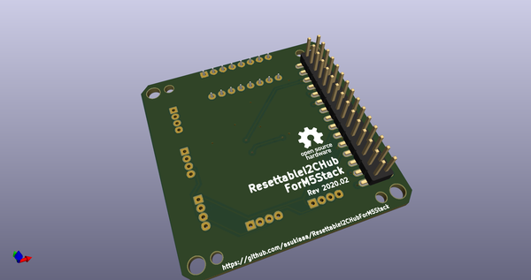
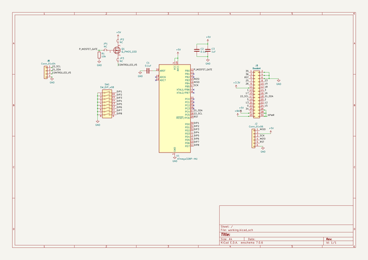
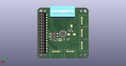
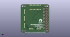

# OOMP Project  
## ResettableI2CHubForM5Stack  by asukiaaa  
  
oomp key: oomp_projects_flat_asukiaaa_resettablei2chubform5stack  
(snippet of original readme)  
  
- ResettableI2CHubForM5Stack  
  
- License  
  
MIT  
  
  full source readme at [readme_src.md](readme_src.md)  
  
source repo at: [https://github.com/asukiaaa/ResettableI2CHubForM5Stack](https://github.com/asukiaaa/ResettableI2CHubForM5Stack)  
## Board  
  
  
## Schematic  
  
  
  
[schematic pdf](working_schematic.pdf)  
## Images  
  
  
  
  
  
  
