# OOMP Project  
## SideBBForESP32DevKitC  by asukiaaa  
  
oomp key: oomp_projects_flat_asukiaaa_sidebbforesp32devkitc  
(snippet of original readme)  
  
- SideBBForESP32DevKitC  
  
A project to extend pins from ESP32DevKitC to arround a mini bread board.  
  
Run the following command to use submodule.  
```  
git submodule update --init  
```  
  
Then open *.kicad_pro with using KiCad.  
  
-- Where to buy  
  
[SideBBForESP32DevKitC - スイッチサイエンス](https://www.switch-science.com/catalog/8071/)  
  
-- License  
  
MIT  
  
-- References  
  
- [製品紹介 SideBB For ESP32DevKitC](https://asukiaaa.blogspot.com/2022/04/SideBBForESP32DevKitC.html)  
  
  full source readme at [readme_src.md](readme_src.md)  
  
source repo at: [https://github.com/asukiaaa/SideBBForESP32DevKitC](https://github.com/asukiaaa/SideBBForESP32DevKitC)  
## Board  
  
[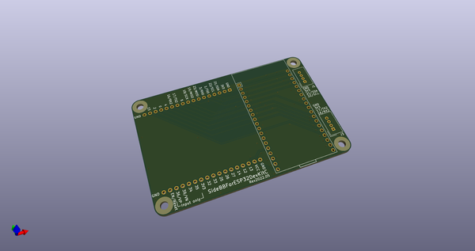](working_3d.png)  
## Schematic  
  
[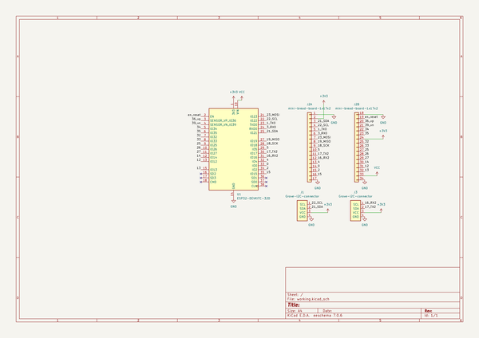](working_schematic.png)  
  
[schematic pdf](working_schematic.pdf)  
## Images  
  
[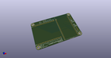](working_3d.png)  
  
[](working_3d_back.png)  
  
[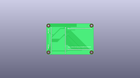](working_3D_bottom.png)  
  
[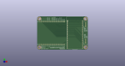](working_3d_front.png)  
  
[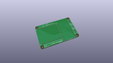](working_3D_top.png)  
  
[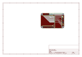](working_assembly_page_01.png)  
  
[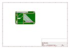](working_assembly_page_02.png)  
  
[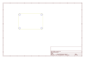](working_assembly_page_03.png)  
  
[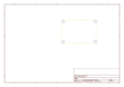](working_assembly_page_04.png)  
  
[](working_assembly_page_05.png)  
  
[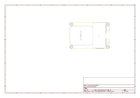](working_assembly_page_06.png)  
