# OOMP Project  
## SideBBForM5Stack  by asukiaaa  
  
(snippet of original readme)  
  
- SideBBForM5Stack  
  
An stack for M5Stack to use bread board easier.  
  
  
  
  
- Where to buy  
  
[SideBBForM5Stack - Switch Science](https://www.switch-science.com/catalog/4098/)  
  
- License  
  
MIT  
  
- References  
  
- [M5Stackの信号線をブレッドボードで扱いやすくするStackを作ってみた](https://asukiaaa.blogspot.com/2018/11/m5stacksidebb.html)  
- [PartsandCircuits/M5Stack-3DPrintFiles](https://github.com/PartsandCircuits/M5Stack-3DPrintFiles)  
- [DIY Mini Proto Board](http://forum.m5stack.com/topic/59/diy-mini-proto-board)  
  
  full source readme at [readme_src.md](readme_src.md)  
  
source repo at: [https://github.com/asukiaaa/SideBBForM5Stack](https://github.com/asukiaaa/SideBBForM5Stack)  
## Board  
  
[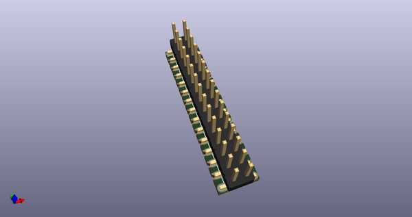](working_3d.png)  
## Schematic  
  
[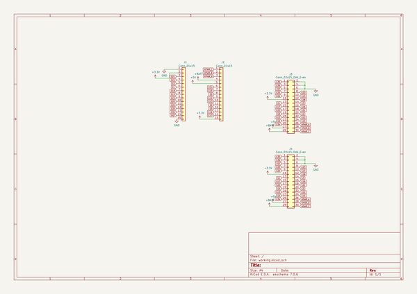](working_schematic.png)  
  
[schematic pdf](working_schematic.pdf)  
## Images  
  
[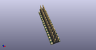](working_3d.png)  
  
[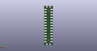](working_3d_back.png)  
  
  
  
[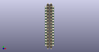](working_3d_front.png)  
  
[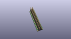](working_3D_top.png)  
  
[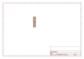](working_assembly_page_01.png)  
  
[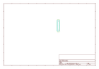](working_assembly_page_02.png)  
  
  
  
[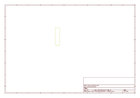](working_assembly_page_04.png)  
  
[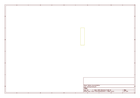](working_assembly_page_05.png)  
  
[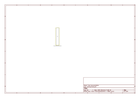](working_assembly_page_06.png)  
