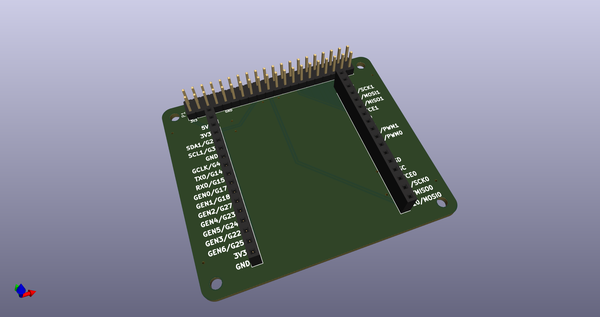
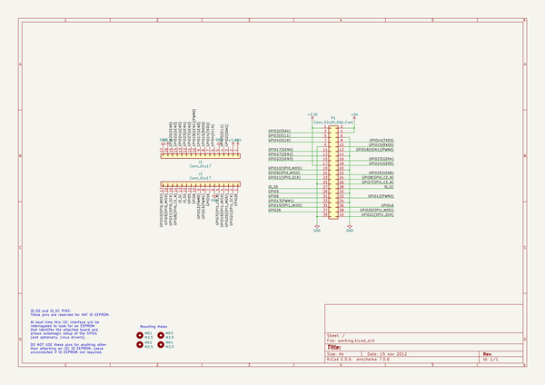
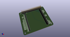
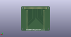
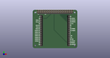

# OOMP Project  
## SideBBForRaspberryPi  by asukiaaa  
  
(snippet of original readme)  
  
- SideBBForRaspberryPi  
  
An expansion board for raspberry pi.  
  
  
  
-- Where to buy  
  
[SideBB for Raspberry Pi はんだ付け済み](https://www.switch-science.com/products/6847)  
  
-- References  
  
- [Raspberry Piの信号線を横に配置したブレッドボードの左右に引き出す基板を作ってみた](https://asukiaaa.blogspot.com/2020/10/sidebb-for-raspberry-pi.html)  
- [Raspberry Pi Mechanical Drawings](https://www.raspberrypi.org/documentation/hardware/raspberrypi/mechanical/README.md)  
  
  full source readme at [readme_src.md](readme_src.md)  
  
source repo at: [https://github.com/asukiaaa/SideBBForRaspberryPi](https://github.com/asukiaaa/SideBBForRaspberryPi)  
## Board  
  
  
## Schematic  
  
  
  
[schematic pdf](working_schematic.pdf)  
## Images  
  
  
  
  
  
  
