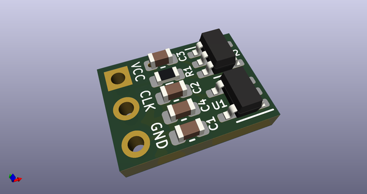
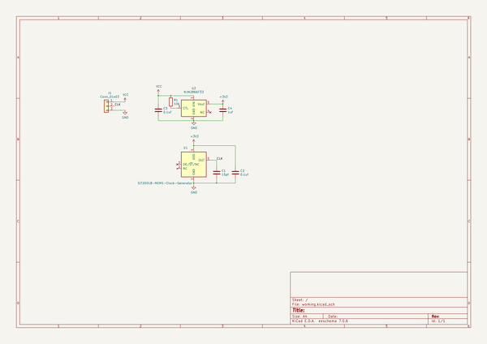
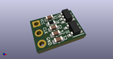
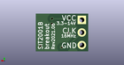
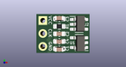

# OOMP Project  
## SIT2001B-breakout  by asukiaaa  
  
oomp key: oomp_projects_flat_asukiaaa_sit2001b_breakout  
(snippet of original readme)  
  
- SIT2001B-breakout  
  
A breakout board of mems SIT2001B with a regulator.  
  
[Schematic](./docs/SIT2001B-breakout.pdf).  
  
-- Components  
  
- [SIT2001B 16MHz](https://akizukidenshi.com/catalog/g/gI-11094/)  
- [NJM2866F33 3.3V 100mA](https://akizukidenshi.com/catalog/g/gI-05448/)  
- 10k 0603  
- 0.1uf (more than 14V) 0603  
- 15pf 0603  
  
-- License  
  
MIT  
  
  full source readme at [readme_src.md](readme_src.md)  
  
source repo at: [https://github.com/asukiaaa/SIT2001B-breakout](https://github.com/asukiaaa/SIT2001B-breakout)  
## Board  
  
  
## Schematic  
  
  
  
[schematic pdf](working_schematic.pdf)  
## Images  
  
  
  
  
  
  
