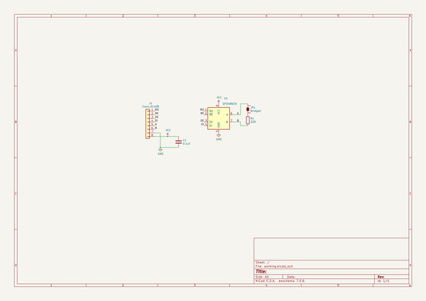
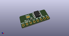
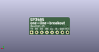
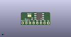

# OOMP Project  
## sp3485-one-line-breakout  by asukiaaa  
  
(snippet of original readme)  
  
- sp3485-one-line-breakout  
  
  
  
-- Setup  
  
To install submodules, run the following command after clone.  
  
```  
git submodule update --init --recursive  
```  
  
-- Where to buy  
  
[sp3485-one-line-breakout - switch science](https://ssci.to/6823)  
  
-- License  
  
MIT  
  
-- References  
  
- [Sparkfun RS485 Transceiver Breakout](https://www.sparkfun.com/products/10124)  
- [Sparkfun RS485 Transceiver Breakout schematic (PDF)](https://cdn.sparkfun.com/datasheets/BreakoutBoards/RS485_Breakout_v10.pdf)  
  
  full source readme at [readme_src.md](readme_src.md)  
  
source repo at: [https://github.com/asukiaaa/sp3485-one-line-breakout](https://github.com/asukiaaa/sp3485-one-line-breakout)  
## Board  
  
[](working_3d.png)  
## Schematic  
  
[](working_schematic.png)  
  
[schematic pdf](working_schematic.pdf)  
## Images  
  
[](working_3d.png)  
  
[](working_3d_back.png)  
  
[](working_3d_front.png)  
