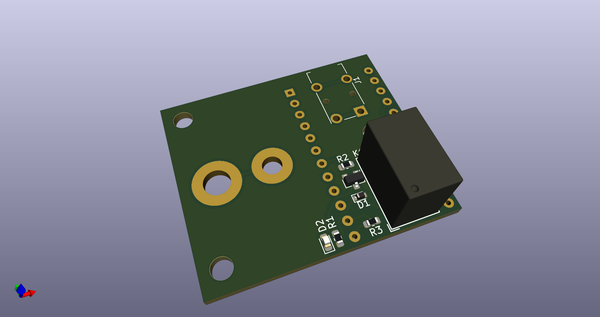
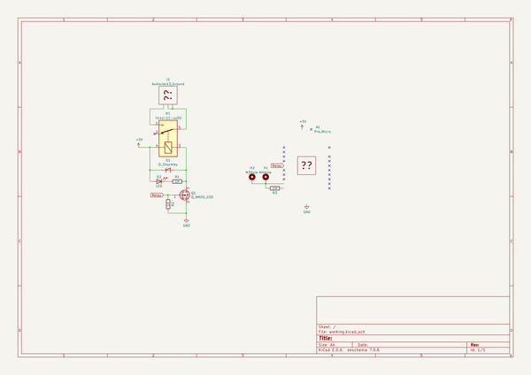
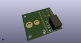
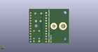
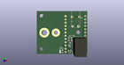

# OOMP Project  
## touch_relay_jack  by asukiaaa  
  
(snippet of original readme)  
  
- touch_relay_jack  
  
  
  
  
Control a audio jack with using relay referencing touch sensor value.  
  
- Pin assign  
  
Pro Micro Pin | Role  
--------- | ----  
D4 | Relay  
D8 | Touch signal in  
D9 | Touch signal out  
  
- Components  
  
- [Relay](http://akizukidenshi.com/catalog/g/gP-01346/)  
- [Mosfet](http://akizukidenshi.com/catalog/g/gI-04256/)  
- [Diode](http://akizukidenshi.com/catalog/g/gI-06467/)  
- [Resistor 1k](http://akizukidenshi.com/catalog/g/gR-06102/)  
- Resistor for touch sensor: [220k](http://akizukidenshi.com/catalog/g/gR-06224/) or [1M](http://akizukidenshi.com/catalog/g/gR-06105/)  
- [3.5mm audio jack](http://akizukidenshi.com/catalog/g/gC-02460/)  
- [LED Green](http://akizukidenshi.com/catalog/g/gI-06417/)  
- Pin Socket  
- Pro Micro  
  
  full source readme at [readme_src.md](readme_src.md)  
  
source repo at: [https://github.com/asukiaaa/touch_relay_jack](https://github.com/asukiaaa/touch_relay_jack)  
## Board  
  
  
## Schematic  
  
  
  
[schematic pdf](working_schematic.pdf)  
## Images  
  
  
  
  
  
  
