# OOMP Project  
## WiredControllerPcb  by asukiaaa  
  
(snippet of original readme)  
  
- WiredControllerPcb  
  
A wired controller that communicate in I2C with using [a library](https://github.com/asukiaaa/WiredController_asukiaaa).  
  
- Where to buy  
  
You can buy it from SwitchSceince.  
  
[WiredController - SwitchSceince](https://www.switch-science.com/catalog/5950/)  
  
- License  
  
MIT  
  
- References  
  
- [WiredController - SwitchSceince](https://www.switch-science.com/catalog/5950/)  
- [WiredController_asukiaaa](https://github.com/asukiaaa/WiredController_asukiaaa)  
  
  full source readme at [readme_src.md](readme_src.md)  
  
source repo at: [https://github.com/asukiaaa/WiredControllerPcb](https://github.com/asukiaaa/WiredControllerPcb)  
## Board  
  
  
## Schematic  
  
[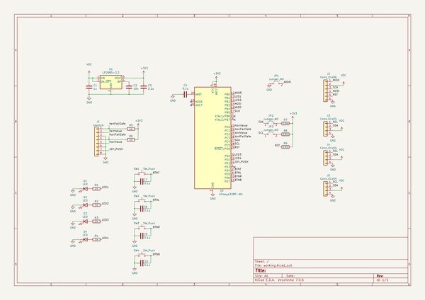](working_schematic.png)  
  
[schematic pdf](working_schematic.pdf)  
## Images  
  
[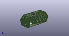](working_3d.png)  
  
[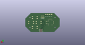](working_3d_back.png)  
  
[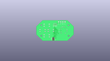](working_3D_bottom.png)  
  
[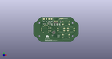](working_3d_front.png)  
  
[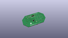](working_3D_top.png)  
  
[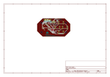](working_assembly_page_01.png)  
  
[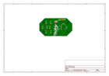](working_assembly_page_02.png)  
  
[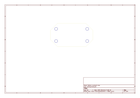](working_assembly_page_03.png)  
  
[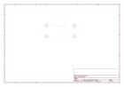](working_assembly_page_04.png)  
  
[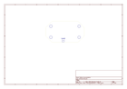](working_assembly_page_05.png)  
  
[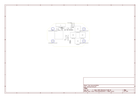](working_assembly_page_06.png)  
