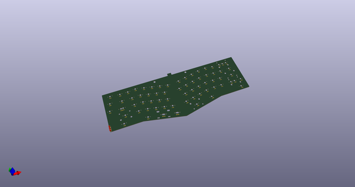
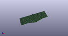
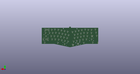
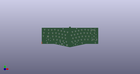

# OOMP Project  
## Alice-Reference  by audrentis  
  
oomp key: oomp_projects_flat_audrentis_alice_reference  
(snippet of original readme)  
  
- Alice-Reference  
* A kicad template project configurated for the Alice layout by Yuktsi   
   
* An FR4 plate using my footprints found [here](https://github.com/audrentis/MX_Plate_Footprints.pretty)  
  
  
  full source readme at [readme_src.md](readme_src.md)  
  
source repo at: [https://github.com/audrentis/Alice-Reference](https://github.com/audrentis/Alice-Reference)  
## Board  
  
  
## Schematic  
  
  
  
[schematic pdf](working_schematic.pdf)  
## Images  
  
  
  
  
  
  
