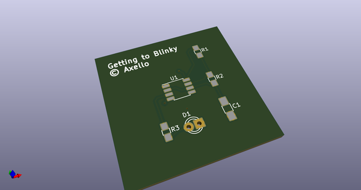
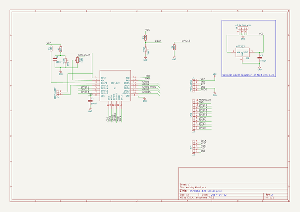
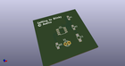
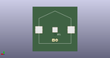
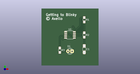

# OOMP Project  
## kicad  by axello  
  
(snippet of original readme)  
  
- kicad playground  
  
Just starting with kicad, this is a hodgepodge of small electronics projects, mostly centered around the ESP8266.  
  
-- ESP-RS232  
A small-footprint design to connect an ESP8266 to a DB9 RS232 interface. Useful to connect to powerbars, power supplies, air quality sensors, solar panel controllers and whatnot.  
  
-- ESP-Sensors  
A design to test the non-breadboardable ESP8266-12E with various sensors. It has a small prototyping area to solder different sensors on.  
  
-- GettingToBlinky  
First kicad tutorial by [Contextual Electronics](https://www.youtube.com/watch?v=JN_Y93RTdSo&list=PLy2022BX6Eso532xqrUxDT1u2p4VVsg-q>)  
  
-- libs  
My components  
  
-- mods  
My footprints  
  
  
  
  full source readme at [readme_src.md](readme_src.md)  
  
source repo at: [https://github.com/axello/kicad](https://github.com/axello/kicad)  
## Board  
  
  
## Schematic  
  
  
  
[schematic pdf](working_schematic.pdf)  
## Images  
  
  
  
  
  
  
