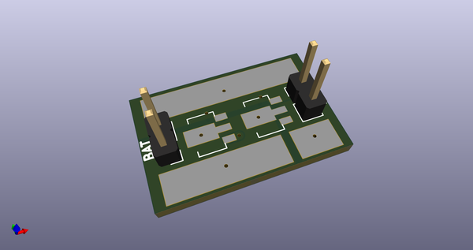
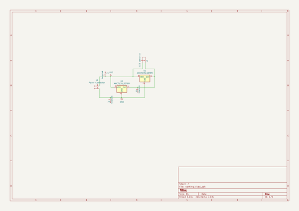
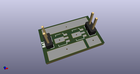
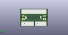
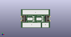

# OOMP Project  
## amc7135-3W-LED-driver  by barafael  
  
(snippet of original readme)  
  
- amc7135-3W-LED-driver  
  
-- Schematic  
  
  
-- PCB render  
  
  
  full source readme at [readme_src.md](readme_src.md)  
  
source repo at: [https://github.com/barafael/amc7135-3W-LED-driver](https://github.com/barafael/amc7135-3W-LED-driver)  
## Board  
  
  
## Schematic  
  
  
  
[schematic pdf](working_schematic.pdf)  
## Images  
  
  
  
  
  
  
