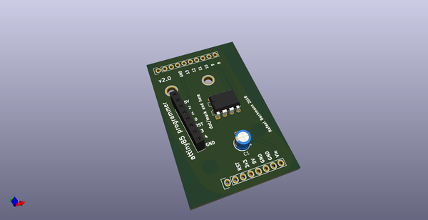
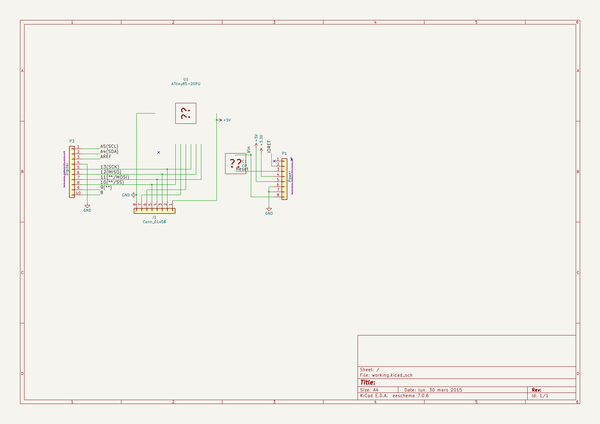
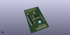
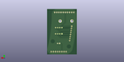
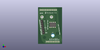

# OOMP Project  
## attiny-programmer  by barafael  
  
(snippet of original readme)  
  
- attiny-programmer  
  
A PCB board to use an Arduino Uno for burning programs to an AVR attiny85 8-pin microcontroller  
  
-- What it does  
  
You can use this Arduino shield to program your attiny chip with a regular Arduino Uno.  
  
To test if it works, you can try the standard blink sketch using pin 2 - that is connected to pin 13  
of the UNO, which has an LED.  
  
-- Preparations  
  
* Follow the steps from [here](http://highlowtech.org/?p=1695) and [here](http://highlowtech.org/?p=1706) to install support for your attiny85 in your Arduino IDE  
* Solder appropriate headers and the 10uF capacitor to the shield  
* Make sure you have selected the standard Arduino IDE presets for the Arduino Uno (Board: Arduino/Genuino Uno, Programmer: AVRISP mkII)  
* Select the sketch ```File -> Examples -> ArduinoISP``` and burn it to your Uno  
* Attach the shield  
* Switch to the attiny board and your appropriate processor (like attiny85) in your IDE  
* Switch your programmer to 'Arduino as ISP'  
* You are now ready to write your attiny85 program to your chip!  
  
-- Circuit  
  
  
  
Based on the circuit [here](http://highlowtech.org/?p=1706). You can either  
bridge the gaps to have a permanent connection to the Arduino Uno, or you can  
solder 2.54'' switches to toggle between the programmer and the output row.  
  
-- PCB  
  
  
  
-- Note  
  
If your   
  full source readme at [readme_src.md](readme_src.md)  
  
source repo at: [https://github.com/barafael/attiny-programmer](https://github.com/barafael/attiny-programmer)  
## Board  
  
[](working_3d.png)  
## Schematic  
  
[](working_schematic.png)  
  
[schematic pdf](working_schematic.pdf)  
## Images  
  
[](working_3d.png)  
  
[](working_3d_back.png)  
  
[](working_3d_front.png)  
