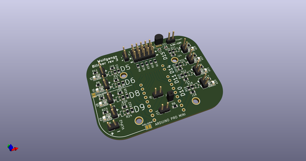
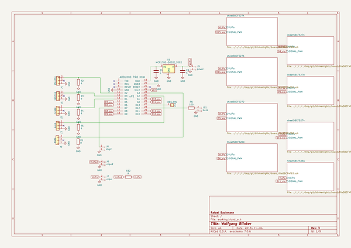
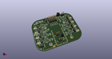
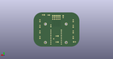
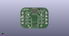

# OOMP Project  
## blinkenlights  by barafael  
  
(snippet of original readme)  
  
- blinkenlights: Blink lights and control other things, controlled by up to 5 input channels  
  
The purpose of this board is to read some standard RC PWM channels, and switch the output MOSFETs accordingly.  
This can be used to blink lights on an RC airplane in patterns, for example. The input channel allows to switch between modes, like standard flying mode and Taxi/Standby modes. Or, a landing light can be switched on/off by a separate channel.  
The channels can be either dedicated lines from the receiver, or just other lines which are in use anyway. For example, the throttle signal could be used to switch between standby and flying, and the landing flaps signal could turn on/off the landing lights.  
  
It would be easily possible to dim lights using PWM, I just have not made use of that yet.  
  
The code pretty much just reads the input channels and reads the state from them, and then passes that state (and a tick value) to a function for each output pin. The function can then decide to do whatever with the output pin.  
  
RC PWM signal is read using interrupts, and the program detects when a signal has been disconnected, resetting the state accordingly. That means that you can attach, detach, and reattach PWM signals during operation as you like.  
  
The I2C pins are still free and accessible, so it would be possible to hook up I2C sensors also, like a temperature sensor on the brakes or a barometer.  
  
Input voltage goes directly to the Pro Mini internal regulator, that means it should be  
  full source readme at [readme_src.md](readme_src.md)  
  
source repo at: [https://github.com/barafael/blinkenlights](https://github.com/barafael/blinkenlights)  
## Board  
  
  
## Schematic  
  
  
  
[schematic pdf](working_schematic.pdf)  
## Images  
  
  
  
  
  
  
