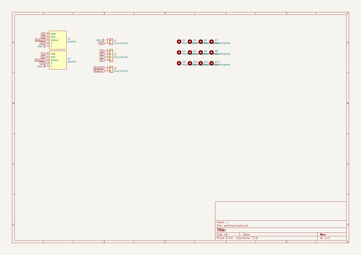

# OOMP Project  
## brick-rover-brainboard  by barafael  
  
oomp key: oomp_projects_flat_barafael_brick_rover_brainboard  
(snippet of original readme)  
  
- brick-rover-brainboard  
A PCB module with stm32f411 "Black Pill" and hc-12 that can serve as basic hobby RC-like sender or receiver.  
  
Notes for next revision:  
Swap analog+pwm headers so that antenna and pwm are on one side, analog on the other. This will make the wires on the sender shorter neater. The rounded edges of the brainboard could face forward. On the analog input board, make the analog outputs a triple-row so that servo male-male can be used to connect signal ground and power.  
Slightly decrease lego hole size.  
  
  full source readme at [readme_src.md](readme_src.md)  
  
source repo at: [https://github.com/barafael/brick-rover-brainboard](https://github.com/barafael/brick-rover-brainboard)  
## Board  
  
  
## Schematic  
  
  
  
[schematic pdf](working_schematic.pdf)  
## Images  
  
  
  
  
  
  
