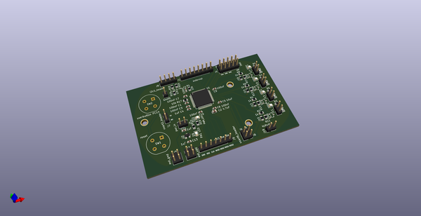
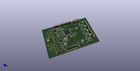
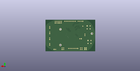
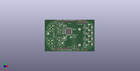

# OOMP Project  
## cortex-m4-dev-board  by barafael  
  
(snippet of original readme)  
  
- cortex-m4-custom-board  
A board with an STM32F401RD LQFP-64 chip and some peripheral headers and mosfet drivers  
  
Schematic:  
  
  
PCB render:  
  
  
PCB:  
  
  
  full source readme at [readme_src.md](readme_src.md)  
  
source repo at: [https://github.com/barafael/cortex-m4-dev-board](https://github.com/barafael/cortex-m4-dev-board)  
## Board  
  
  
## Schematic  
  
  
  
[schematic pdf](working_schematic.pdf)  
## Images  
  
  
  
  
  
  
