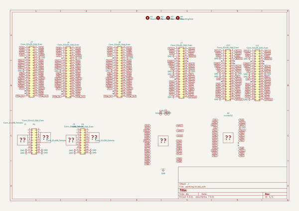
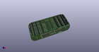
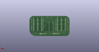
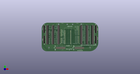

# OOMP Project  
## nucleo-harness  by barafael  
  
oomp key: oomp_projects_flat_barafael_nucleo_harness  
(snippet of original readme)  
  
- Nucleo Harness  
  
This circuit board is a harness for a nucleo board. It allows to embed a nucleo into a reproducible environment (less jumper wires).  
2x16 pins can be connected to a saleae 16 protocol analyzer or any other 2x8 connector.  
The mapping of pins which are connected to the 2x8 connectors can be made with jumper wires or with small addon PCBs.  
Additionally, labeled pin header/sockets expose the regular nucleo64 pins.  
  
  
  
  full source readme at [readme_src.md](readme_src.md)  
  
source repo at: [https://github.com/barafael/nucleo-harness](https://github.com/barafael/nucleo-harness)  
## Board  
  
  
## Schematic  
  
  
  
[schematic pdf](working_schematic.pdf)  
## Images  
  
  
  
  
  
  
