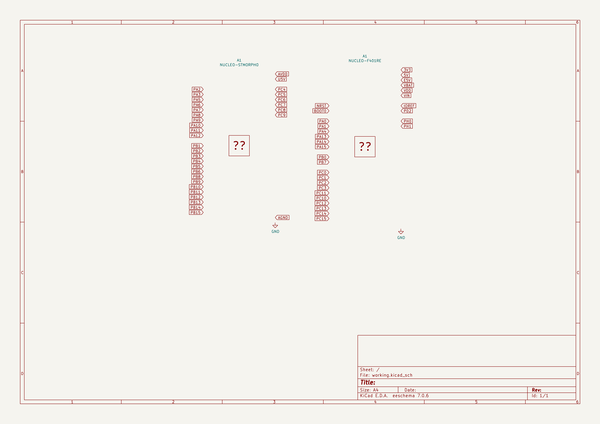
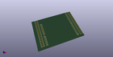
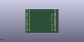
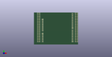

# OOMP Project  
## nucleo-stmorpho-kicad  by barafael  
  
oomp key: oomp_projects_flat_barafael_nucleo_stmorpho_kicad  
(snippet of original readme)  
  
- nucleo-stmorpho-kicad  
  
KiCAD files for a st nucleo/st morpho connector. Net labels added.  
  
  full source readme at [readme_src.md](readme_src.md)  
  
source repo at: [https://github.com/barafael/nucleo-stmorpho-kicad](https://github.com/barafael/nucleo-stmorpho-kicad)  
## Board  
  
  
## Schematic  
  
  
  
[schematic pdf](working_schematic.pdf)  
## Images  
  
  
  
  
  
  
