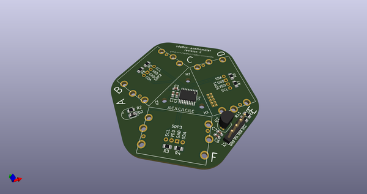
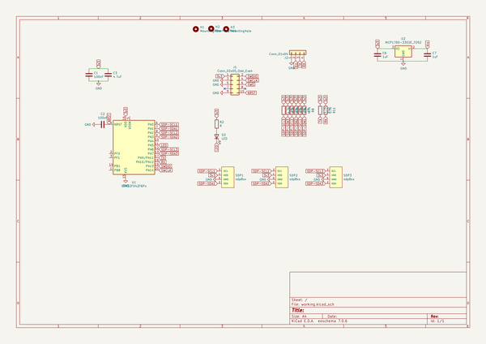
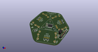
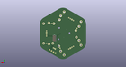
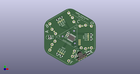

# OOMP Project  
## sdp8xx-anemometer-pcb  by barafael  
  
(snippet of original readme)  
  
  
  
  
  
  
  
  
  
  full source readme at [readme_src.md](readme_src.md)  
  
source repo at: [https://github.com/barafael/sdp8xx-anemometer-pcb](https://github.com/barafael/sdp8xx-anemometer-pcb)  
## Board  
  
  
## Schematic  
  
  
  
[schematic pdf](working_schematic.pdf)  
## Images  
  
  
  
  
  
  
