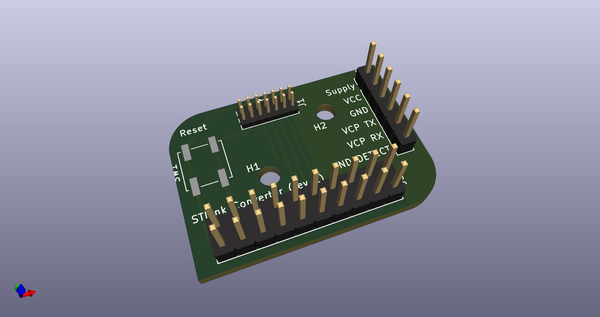
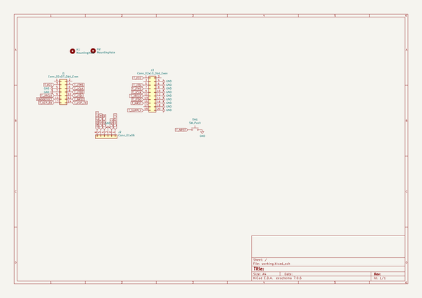
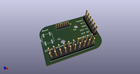
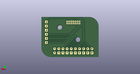
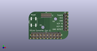

# OOMP Project  
## stlink-converter  by barafael  
  
oomp key: oomp_projects_flat_barafael_stlink_converter  
(snippet of original readme)  
  
- stlink-converter  
  
The little arrows ('∨') mark the side of the stlink socket with the gap.  
  
  
  
  
  
  full source readme at [readme_src.md](readme_src.md)  
  
source repo at: [https://github.com/barafael/stlink-converter](https://github.com/barafael/stlink-converter)  
## Board  
  
  
## Schematic  
  
  
  
[schematic pdf](working_schematic.pdf)  
## Images  
  
  
  
  
  
  
