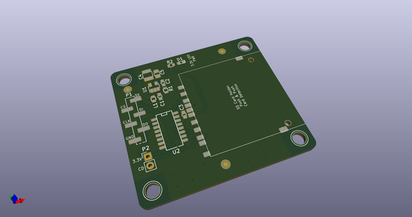
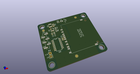
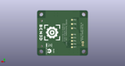
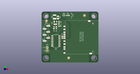

# OOMP Project  
## BCN3DSigma-Electronics  by BCN3D  
  
(snippet of original readme)  
  
  
  
- BCN3D Electronics  
  
This repository will hold all the information about the Electronics of the BCN3D Sigma.  
  
As a declared Open Source organization, it's in our mission to release all the original design files to you to be able to learn, reuse and improve. Open Source not only means code, it also concerns hardware.  
  
We've managed to design and manufacture our custom Electronics for the BCN3D Sigma in many ways thanks to the community and other Open Source Hardware projects.  
BCN3D Electronics is a mashup between the [Ultimaker 2 Board](https://github.com/Ultimaker/Ultimaker2) , the [Megatronics v3.0](http://reprap.org/wiki/Megatronics_3.0) and some others...  
  
-- Design concept  
  
The BCN3D Electronics is intended to be modular and custom fitted in our BCN3D Sigma 3D printer and that's why we made some design decisions.  
  
1. Stepper drivers out of the Mainboard. As the drivers generate quite a lot of heat, we've moved them nearest as possible to the corresponding stepper motor. If one fails, you just have to replace a cheap stepper driver board. This way, we've managed to fit an entire electronics system without a fan.  
2. FFC's everywhere. The BCN3D Sigma is an Independent Dual Extruder Printer so the Electronics supports 6  Axis of movement. Thats a lot of wires and wires takes some precious space. We deci  
  full source readme at [readme_src.md](readme_src.md)  
  
source repo at: [https://github.com/BCN3D/BCN3DSigma-Electronics](https://github.com/BCN3D/BCN3DSigma-Electronics)  
## Board  
  
  
## Schematic  
  
  
  
[schematic pdf](working_schematic.pdf)  
## Images  
  
  
  
  
  
  
