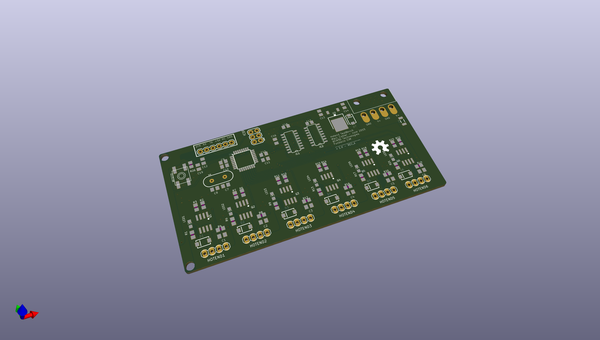
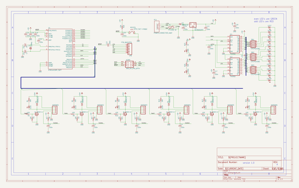

# OOMP Project  
## Hotend-Test-Bench  by BCN3D  
  
(snippet of original readme)  
  
- Hotend test bench  
This project is a test bench for BCN3D Technologies.  
  
It consist on a electronics Board to test out 6 Hotends at a time. It basically heats up the 6 hotends to a specified temperature and then cools them down.  
It verifies that the time to do the cycle is correct.  
  
![Hotend Test Jig][system]  
  
[system]:  https://github.com/BCN3D/Hotend-Test-Jig/blob/master/img/system.JPG  
  
---- Folders  
  
- _BOM: _ here you can find the electronic components for the board.  
- _Code:_ the files of the firmware for the microcontroller. It has been developed in Atmel Studio 7.0  
- _Gerbers:_ the gerber files of the board.  
- _TemperaturesPlotter:_ Processing file that plots the temperatures sent by the board. It is exported to Windows based systems in order to run the program without installing processing IDE.  
- _Eagle files:_ original design files in CadSoft Eagle.  
- _img:_ just some pictures of the project.  
  
-- Electronics  
The electronics consist on a board with an ATmega328, 6 Power Mosfets and 2 Leds for each power channel to display the status.  
The temperature is sensed by the hotend thermistors and each signal goes to a ADC channel of the microcontroller.  
  
The 12 LEDs are driven by 2 8-bit shift registers.  
  
It is powered by a 24V/320W switching Power supply and a +5V LDO for the logic.  
For communication, it has FTDI compatible pin headers.  
  
Board Front  
  
![Board Front][board_front]  
  
Board Rear  
  
![Board Rear][board_rear]  
  
[board_front]: https://github.com/BCN3D/Hotend-Test-Jig/bl  
  full source readme at [readme_src.md](readme_src.md)  
  
source repo at: [https://github.com/BCN3D/Hotend-Test-Bench](https://github.com/BCN3D/Hotend-Test-Bench)  
## Board  
  
  
## Schematic  
  
  
  
[schematic pdf](working_schematic.pdf)  
## Images  
