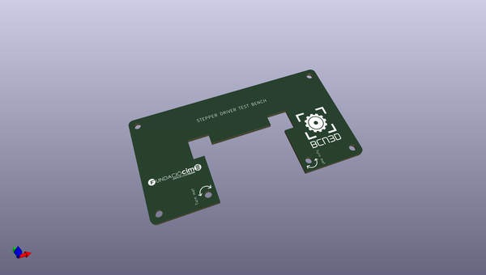
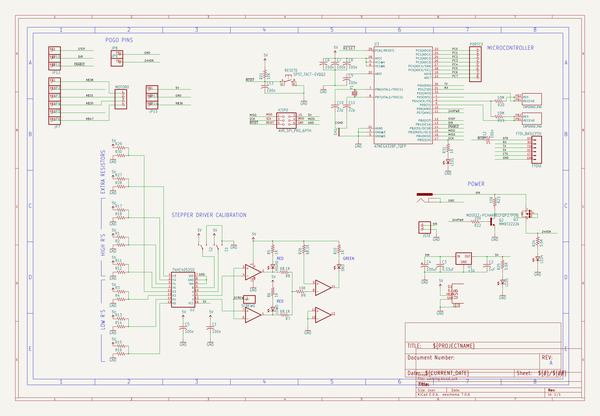

# OOMP Project  
## Stepper-Driver-testbench  by BCN3D  
  
(snippet of original readme)  
  
- Stepper Driver Test Bench  
Electronics Test Bench used for testing and callibrating the Stepper drivers for the BCN3D Sigma.  
It's based on a Pogo bed system where the bottom board has the components and the other two boards serve as support for  
the board to test (Stepper driver).  
  
Basically it's made for callibrating the power of the DRV8825 based Stepper drivers used in the BCND3D Sigma and testing them out  
with a real motor.  
  
It uses capacitive touch sensor instead of mechanical switches as it will be used a lot...  
We were inspired by the awesome tutorial by [Sparkfun](https://learn.sparkfun.com/tutorials/constant-innovation-in-quality-control?_ga=1.225836058.1496890805.1425539418)  
  
--Code  
Implements the [AccelStepper](http://www.airspayce.com/mikem/arduino/AccelStepper/) Library and [Capacitive Sensor Library](http://playground.arduino.cc/Main/CapacitiveSensor?from=Main.CapSense).  
  
One button conmutes the 24 Volt in from the power supply to avoid shorts and the other button starts a motor routine to test  
the motor.  
  
  
  full source readme at [readme_src.md](readme_src.md)  
  
source repo at: [https://github.com/BCN3D/Stepper-Driver-testbench](https://github.com/BCN3D/Stepper-Driver-testbench)  
## Board  
  
  
## Schematic  
  
  
  
[schematic pdf](working_schematic.pdf)  
## Images  
