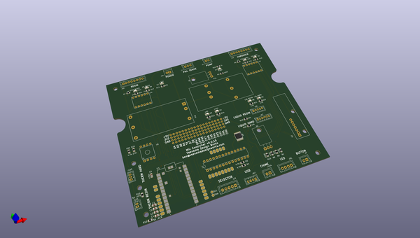
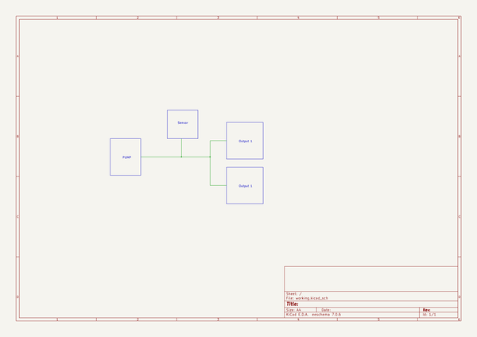

# OOMP Project  
## MixController  by bveenema  
  
(snippet of original readme)  
  
- Mix Controller  
A chrome extension user interface and embedded firmware for controlling mixing pumps.  
  
---- Index  
1. User Interface (Chrome Extension)  
  * [Installation](-installation)  
  * [Create Shortcuts](-create-shortcuts)  
  * [How to Use](-how-to-use)  
1. Firmware (Mixer Software)  
  * [Driver Installation](-driver-installation)  
  
-- User Interface (Chrome Extension)  
--- Installation  
To install the user interface:  
1. Download the CRX file from the latest release  
  - Go to [MixController/releases](https://github.com/bveenema/MixController/releases)  
  - Click the **.crx** file in this *Assets* of the latest realese  
  ![Img of where to download CRX file][JPG_downloadCRX]  
  
2. Open the **Extensions** page in Chrome  
![Type "chrome://extensions" in the address bar][JPG_GoToExtensions]  
  
3. Install the App  
  - Click and drag the CRX file into the *Extensions* window  
  ![Install the App][JPG_installApp]  
  
4. Accept the Permsions  
  - Mix Controller requires access to your computers serial devices, click *Add App* to approve  
  ![Img of Accept Permissions][JPG_acceptPermissions]  
  
5. See [App Readme](https://github.com/bveenema/MixController/blob/master/Chrome%20Extension/README.md) for information on launching and using the app  
  
--- Create Shortcuts  
To create Desktop/Start Menu/Taskbar shortcuts:  
1. Click **Details** under Mix Controller, select **Create Shortcuts...** , select or deselect the shortcuts you want to create , click **Create**  
![How to create shortcuts][JPG_CreateShortcuts  
  full source readme at [readme_src.md](readme_src.md)  
  
source repo at: [https://github.com/bveenema/MixController](https://github.com/bveenema/MixController)  
## Board  
  
  
## Schematic  
  
  
  
[schematic pdf](working_schematic.pdf)  
## Images  
