# OOMP Project  
## firefly2  by candykingdom  
  
(snippet of original readme)  
  
- Firefly2  
  
-- Programming  
  
The `fancy-node` device can be programmed either using an STLink, or via USB port. To program via USB, you must first install [stm32loader] using pip (`pip install stm32loader`). You may also need to pass the port (typically `/dev/ttyUSB0`), e.g. `pio run -e fancy-node-usb -t upload --upload-port /dev/ttyUSB0`.  
  
--- Saving device description in flash  
  
Both `node` and `fancy-node` support reading the [`DeviceDescription`](lib/device/DeviceDescription.hpp) from flash. The modes are defined by the `DeviceMode` enum within [`DeviceDescription.hpp`](lib/device/DeviceDescription.hpp). They work as follows:  
  
- `CURRENT_FROM_HEADER`: use the `current` device defined in [`Devices.hpp`](lib/device/Devices.hpp)  
- `READ_FROM_FLASH`: read the device saved in flash, if present. If not present (determined by the validity of `check_value`), fall back to `current`.  
- `WRITE_TO_FLASH`: write `current` to flash, and then use it. This will only write the device to flash if it is different, to avoid causing flash wear.  
  
  full source readme at [readme_src.md](readme_src.md)  
  
source repo at: [https://github.com/candykingdom/firefly2](https://github.com/candykingdom/firefly2)  
## Board  
  
[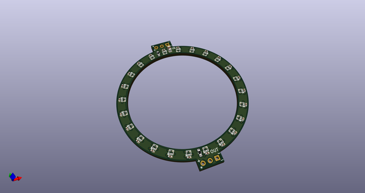](working_3d.png)  
## Schematic  
  
[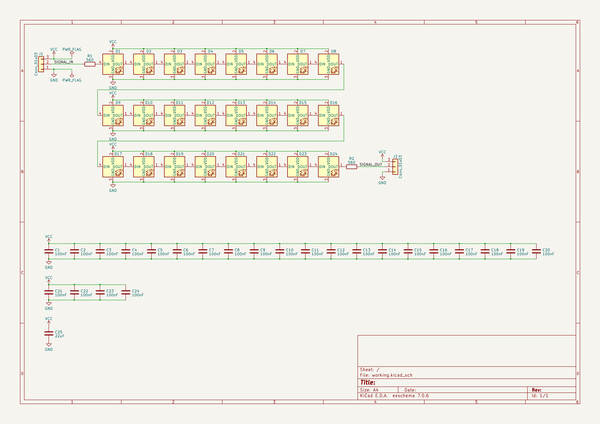](working_schematic.png)  
  
[schematic pdf](working_schematic.pdf)  
## Images  
  
[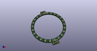](working_3d.png)  
  
[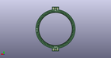](working_3d_back.png)  
  
  
  
[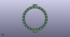](working_3d_front.png)  
  
[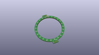](working_3D_top.png)  
  
[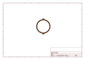](working_assembly_page_01.png)  
  
[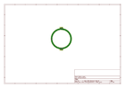](working_assembly_page_02.png)  
  
  
  
[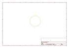](working_assembly_page_04.png)  
  
[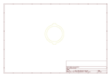](working_assembly_page_05.png)  
  
[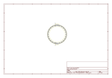](working_assembly_page_06.png)  
