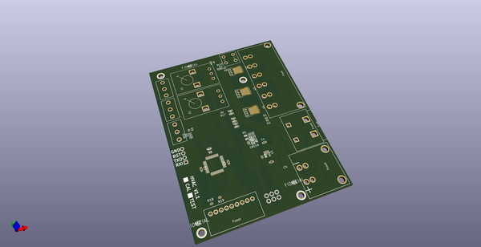
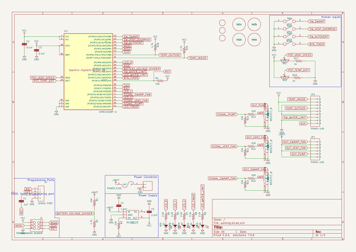
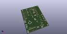
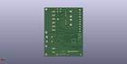
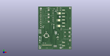

# OOMP Project  
## hvac  by candykingdom  
  
oomp key: oomp_projects_flat_candykingdom_hvac  
(snippet of original readme)  
  
- Playa engineering!  
  
-- Installing the breadboard in arduino  
  
You have to install the board type "atmega328 on a breadboard". Follow the  
instructions in [Minimal Circuit (Eliminating the External  
Clock)](https://www.arduino.cc/en/Tutorial/ArduinoToBreadboard)  
  
-- Digikey components  
  
  
Power:  
  
[Sabre flat blade literature](http://www.literature.molex.com/SQLImages/kelmscott/Molex/PDF_Images/987650-5662.PDF)  
  
For a 10 foot run @ 12v 4A, allowing for 3% voltage drop.  
  
Wire Size           14 AWG  
Voltage at Max Drop 11.64 V  
  
 *  [Board Side](https://www.digikey.com/product-detail/en/molex-llc/0431601102/WM18483-ND/300116)  
 *  [Cable Side](https://www.digikey.com/products/en?keywords=44441-2002)  
 *  [Crimp](https://www.digikey.com/product-detail/en/molex-llc/0433750001/WM9174CT-ND/300126)  
  
Motors:  
 *  [Board Side](http://www.mouser.com/ProductDetail/Molex/43160-3106/?qs=sGAEpiMZZMs%252bGHln7q6pm%252bS0pk2Wo0XxzlBm66UhqE8%3d)  
 *  [Cable Side](https://www.digikey.com/product-detail/en/molex-llc/0444412006/WM18467-ND/300100) - Find the cable side version  
 *  Same crimps  
  
Data:  
  
 *  [Board Side](https://www.digikey.com/short/3nbvwp)  
 *  [Cable Side](https://www.digikey.com/product-detail/en/molex-llc/0511030900/WM13237-ND/3262504)  
 *  [Crimp](https://www.digikey.com/product-detail/en/molex-llc/0503518000/WM3320CT-ND/2405712)  
  
More components:  
  
 *  [Through hole potentiometer](https://www.digikey.com/product-detail/en/bourns-inc/PDB12-H4301-103BF/PDB12-H4301-103BF-ND/3780664)  
 *  [Throu  
  full source readme at [readme_src.md](readme_src.md)  
  
source repo at: [https://github.com/candykingdom/hvac](https://github.com/candykingdom/hvac)  
## Board  
  
  
## Schematic  
  
  
  
[schematic pdf](working_schematic.pdf)  
## Images  
  
  
  
  
  
  
