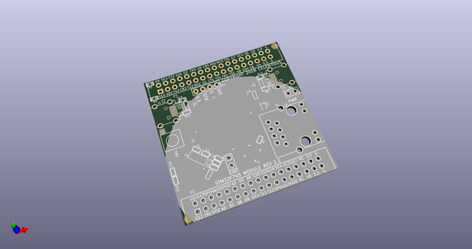
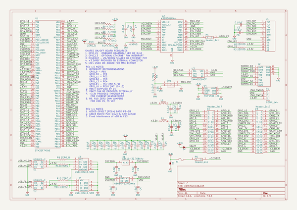
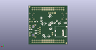
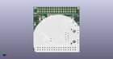

# OOMP Project  
## STM32F745VE_Module  by celeritous  
  
(snippet of original readme)  
  
- STM32F745VE_Module  
This repository is for an STM32F745VE Cortex M7 32bit ARM processor module. The design supports most of the STM32F7xx processors in the QFP100 package.   
  
The design is in KiCad and is released under the CERN OHL Ver 1.2 It is on a 50mm x 50mm 4 layer PCB with two 38 Pin dual row 100mil headers for user power and IO. There is no on-board voltage regulation so the user must supply regulated 3.3V power to the board.   
  
Features include a USB FS and HS ports that can function as host or client as well as and optional uSD card slot and optional Ethernet RMII PHY chip and connector.    
  
Along with the hardware design, the repository also contains a sample STM32CubeMX pin assignemt project file and a sample Atollic TrueStudio project file generated by the STM32CubeMX project file.  
  
  full source readme at [readme_src.md](readme_src.md)  
  
source repo at: [https://github.com/celeritous/STM32F745VE_Module](https://github.com/celeritous/STM32F745VE_Module)  
## Board  
  
  
## Schematic  
  
  
  
[schematic pdf](working_schematic.pdf)  
## Images  
  
  
  
  
  
  
