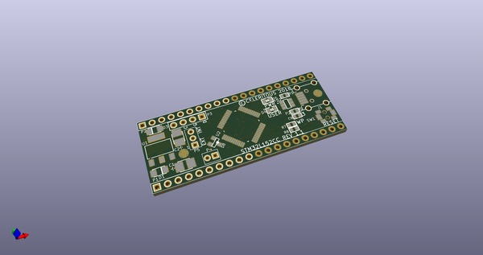
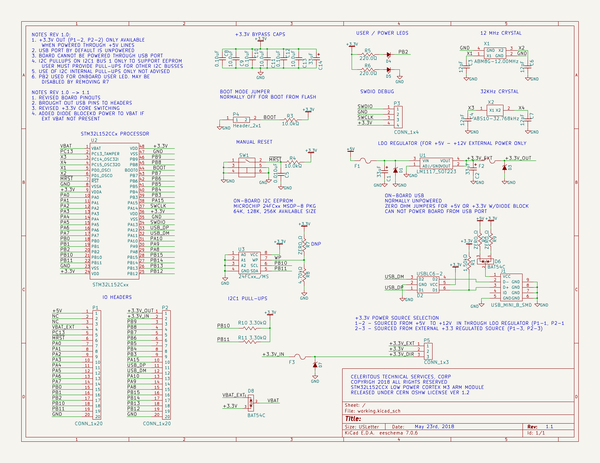
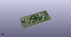
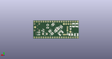
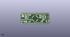

# OOMP Project  
## STM32L152CCx_MODULE  by celeritous  
  
oomp key: oomp_projects_flat_celeritous_stm32l152ccx_module  
(snippet of original readme)  
  
This repository contains the hardware design and firmware templates for Celeritous' newest processor module. This board is based on the ST Micro Cortex M3 Low power STM32L151/152 processor line.   
  
The current revision is 1.0 and this is the initial commit for review and comment.   
  
It is being released as Open Source Hardware under the CERN OSH License ver 1.2  
  
All hardware design files are in KiCAD format  
  
All Firmware files will be based on code generated by and for the STM32MXCube code initialization generator and Atollic TrueStudio development environment.   
  
If users wish to adapt this for use with the Arduino environment they are welcome to do so and we will gladly post it, but our main focus will continue to be based on the TrueStudio environment.  
  
The board has the following features:  
1. Small form factor 2.0" x 0.800" (same form factor as STM32F103 "Blue Pill" board but is NOT pin compatible  
2. 2 x 20 pin 0.100" pitch headers spaced 0.700 apart (Different spacing than Blue Pill)  
3. On-board 3.3V regulator to allow +5V external power  
4. External +3.3V power also accepted  
5. Board power source is jumper selectable between un-regulated external +5 or external regulated +3.3V  
6. Regulated, fused +3.3V power available for user when +5V input is used  
7. Power inputs are fused, inverse voltage protected and overvoltage protected  
8. 1 USB host/client port with Mini-B connector soldered to board - won't shear off board  
9. USB port transient protected, includes 1.5K pull-up   
10.  
  full source readme at [readme_src.md](readme_src.md)  
  
source repo at: [https://github.com/celeritous/STM32L152CCx_MODULE](https://github.com/celeritous/STM32L152CCx_MODULE)  
## Board  
  
  
## Schematic  
  
  
  
[schematic pdf](working_schematic.pdf)  
## Images  
  
  
  
  
  
  
