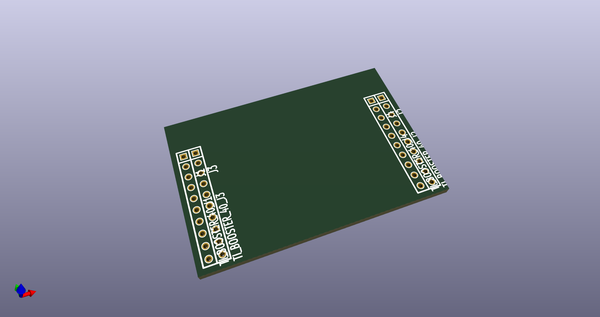
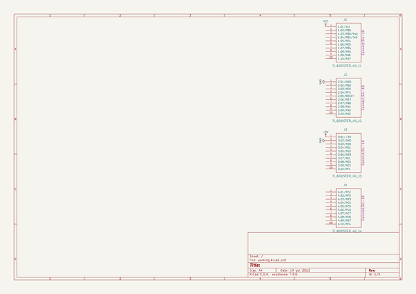
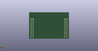
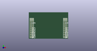

# OOMP Project  
## kicad-library  by cepr  
  
(snippet of original readme)  
  
KiCad Library  
=============  
  
This repository contains the official schematic and 3D libraries supported by the KiCad library team.  
  
The footprint libraries are the `*.pretty` repos themselves and are used online by default. If you want to download them locally, the `library-repos-install.bat` and `library-repos-install.sh` scripts [in the KiCad source](http://bazaar.launchpad.net/~kicad-product-committers/kicad/product/files/head:/scripts/) can do this automatically.  
  
  
How to Contribute  
=================  
  
Please, check the [CONTRIBUTING.md](CONTRIBUTING.md) file, or refer to the [Wiki Page](https://github.com/KiCad/kicad-library/wiki/How-To-Contribute).  
  
Further Information  
===================  
  
* [KiCad Website](http://kicad-pcb.org/contribute/librarians/)  
* [KiCad Library Convention](https://github.com/KiCad/kicad-library/wiki/Kicad-Library-Convention) (KLC)  
* [KiCad Library Wiki](https://github.com/KiCad/kicad-library/wiki)  
  
  full source readme at [readme_src.md](readme_src.md)  
  
source repo at: [https://github.com/cepr/kicad-library](https://github.com/cepr/kicad-library)  
## Board  
  
  
## Schematic  
  
  
  
[schematic pdf](working_schematic.pdf)  
## Images  
  
  
  
  
  
  
