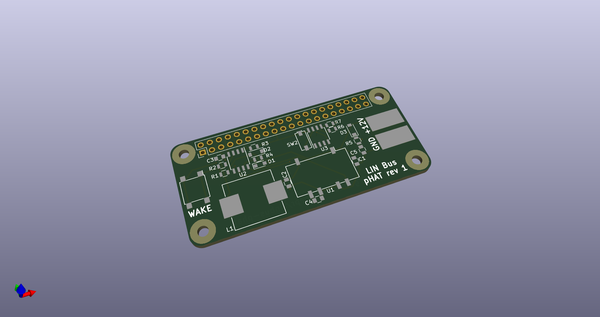
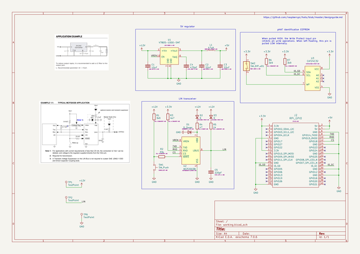
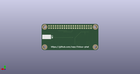
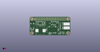

# OOMP Project  
## linbus-phat  by cepr  
  
oomp key: oomp_projects_flat_cepr_linbus_phat  
(snippet of original readme)  
  
- linbus-phat  
LIN Bus interface for Raspberry PI Zero  
  
  full source readme at [readme_src.md](readme_src.md)  
  
source repo at: [https://github.com/cepr/linbus-phat](https://github.com/cepr/linbus-phat)  
## Board  
  
  
## Schematic  
  
  
  
[schematic pdf](working_schematic.pdf)  
## Images  
  
  
  
  
  
  
