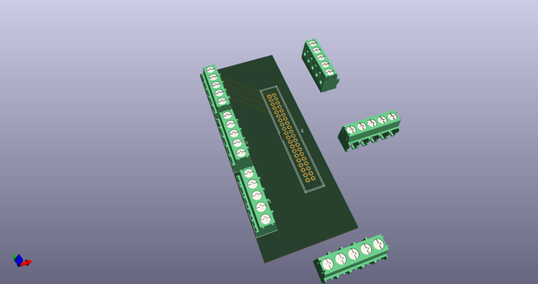
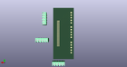
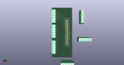

# OOMP Project  
## speeduino  by cepr  
  
(snippet of original readme)  
  
  
| |  |  
| --- | --- |  
| **Dev Status** |  |  
| **Latest Release** |  |  
| **MISRA Status** |  |  
| **Feature Bounties** |   
  
Speeduino  
=========  
  
The Speeduino project is a flexible, fully featured Engine Management Systems (EMS aka ECU) based on the low cost and open source Arduino platform. It provides all standard engine management functions and is constantly growing to support more features and with wider engine compatibility.   
  
FAQ:  
=========  
  
========================================================================  
  
Q: Arduino ECU,pffft, heard THAT before. Does this one actually work?  
  
A: Yep! 1, 2, 3, 4, 5, 6 and 8 cylinder engines have all run using Speeduino. At last count over 700 engines were running on this platform, but this figure is growing all the time.   
  
========================================================================  
  
Q: So what can it do?  
  
A: Take a look at this page for details: http://speeduino.com/wiki/index.php/Overview  
  
========================================================================  
  
Q: Target platform?  
  
A:  
  full source readme at [readme_src.md](readme_src.md)  
  
source repo at: [https://github.com/cepr/speeduino](https://github.com/cepr/speeduino)  
## Board  
  
  
## Schematic  
  
  
  
[schematic pdf](working_schematic.pdf)  
## Images  
  
  
  
  
  
  
