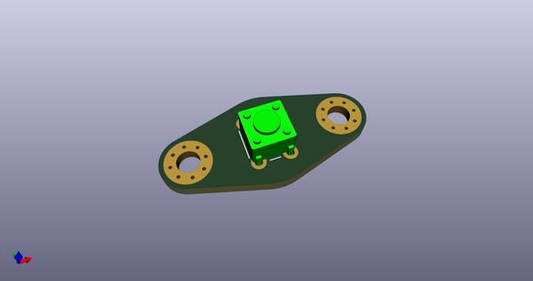
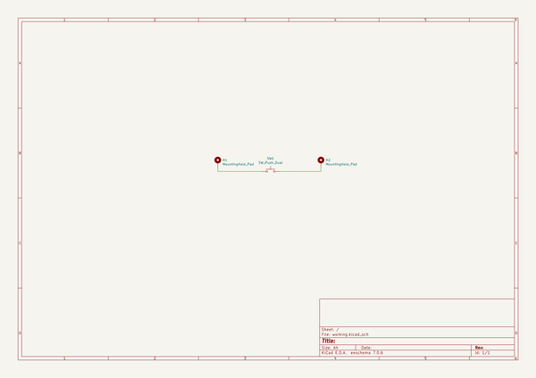
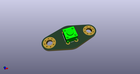
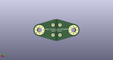
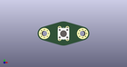

# OOMP Project  
## vw-bus-77-electrical-washer-switch-adapter  by cepr  
  
(snippet of original readme)  
  
- vw-bus-77-electrical-washer-switch-adapter  
Convert your VW bus washer switch to an electrical push button  
  
You can purchase it on OSH Park here: https://oshpark.com/shared_projects/CfsMA4pX  
  
  full source readme at [readme_src.md](readme_src.md)  
  
source repo at: [https://github.com/cepr/vw-bus-77-electrical-washer-switch-adapter](https://github.com/cepr/vw-bus-77-electrical-washer-switch-adapter)  
## Board  
  
  
## Schematic  
  
  
  
[schematic pdf](working_schematic.pdf)  
## Images  
  
  
  
  
  
  
