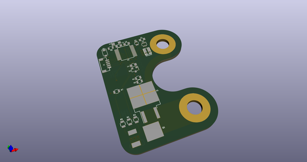
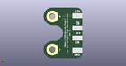
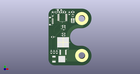

# OOMP Project  
## vw-bus-project-fuel-pump-driver  by cepr  
  
(snippet of original readme)  
  
- vw-bus-project-fuel-pump-driver  
Fuel pump driver interfaced on a LIN bus  
  
- Licenses  
The schematics and layout are under the TAPR Open Hardware License v1.0  
  
  
  full source readme at [readme_src.md](readme_src.md)  
  
source repo at: [https://github.com/cepr/vw-bus-project-fuel-pump-driver](https://github.com/cepr/vw-bus-project-fuel-pump-driver)  
## Board  
  
  
## Schematic  
  
  
  
[schematic pdf](working_schematic.pdf)  
## Images  
  
  
  
  
  
  
