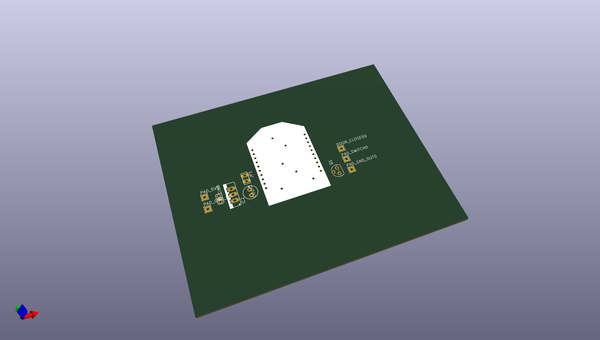
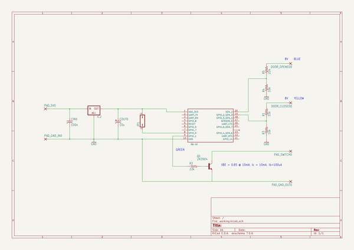

# OOMP Project  
## wifly-remote-android  by cepr  
  
oomp key: oomp_projects_flat_cepr_wifly_remote_android  
(snippet of original readme)  
  
wifly-remote-android  
====================  
  
Garage door remote control for Android using a Roving Network WiFly module.  
  
  full source readme at [readme_src.md](readme_src.md)  
  
source repo at: [https://github.com/cepr/wifly-remote-android](https://github.com/cepr/wifly-remote-android)  
## Board  
  
  
## Schematic  
  
  
  
[schematic pdf](working_schematic.pdf)  
## Images  
