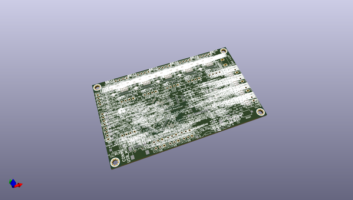

# OOMP Project  
## 3DPCB  by ChristianLerche  
  
oomp key: oomp_projects_flat_christianlerche_3dpcb  
(snippet of original readme)  
  
- 3DPCB  
3DPCB DRV8825 files - KiCAD  
  
This git contains the files necessary to make 3DPCB.   
  
It's designed in KiCAD mostly using library I created.   
  
I had an early version, which couldn't run the motors, as the DRV8825 was not receiving 3.3V.   
It has been fixed in the PCB, but it hasn't been tested through production.   
  
The board is 2 layer, so cheap prototype PCB service sites can produce them.   
Size is 100x60mm, so around $20 for 10 pcs is possible.   
  
  
  full source readme at [readme_src.md](readme_src.md)  
  
source repo at: [https://github.com/ChristianLerche/3DPCB](https://github.com/ChristianLerche/3DPCB)  
## Board  
  
  
## Schematic  
  
  
  
[schematic pdf](working_schematic.pdf)  
## Images  
