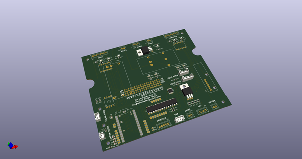
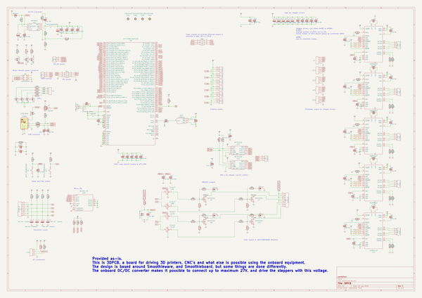
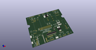
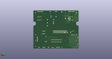
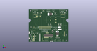

# OOMP Project  
## 3DPCB-4LAYER  by ChristianLerche  
  
(snippet of original readme)  
  
- 3DPCB-4LAYER  
Works like it should.  
  
USE IS AT YOUR OWN RISK! This design is not intended for copying, or using.  
  
IF you choose to build/redesign/produce or whatever, go for the A5984-edge - Best design, best drivers!  
  
  full source readme at [readme_src.md](readme_src.md)  
  
source repo at: [https://github.com/ChristianLerche/3DPCB-4LAYER](https://github.com/ChristianLerche/3DPCB-4LAYER)  
## Board  
  
  
## Schematic  
  
  
  
[schematic pdf](working_schematic.pdf)  
## Images  
  
  
  
  
  
  
