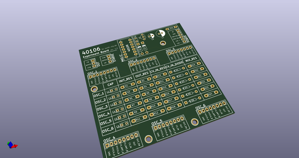
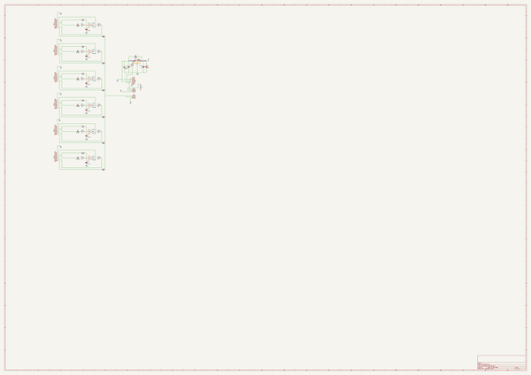
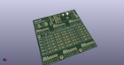
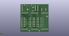
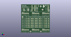

# OOMP Project  
## 40106  by cmos-droner  
  
(snippet of original readme)  
  
- 40106 - CMOS Dronesynth  
This is a basic 40106-circuit with all 6 oscillators routet. You can use it to build a simple 40106-drone-box but also more sophisticated setups are easily doable (add cv control, modulate oscillators with each other etc.)  
  
-- The circuit  
The circuit is based around a single of 40106 hex-schmitt trigger.  
  
-- PCB v1  
PCB v1 (in core folder) has a few bugs, which will be described soon in the build doc.  
  
  full source readme at [readme_src.md](readme_src.md)  
  
source repo at: [https://github.com/cmos-droner/40106](https://github.com/cmos-droner/40106)  
## Board  
  
  
## Schematic  
  
  
  
[schematic pdf](working_schematic.pdf)  
## Images  
  
  
  
  
  
  
